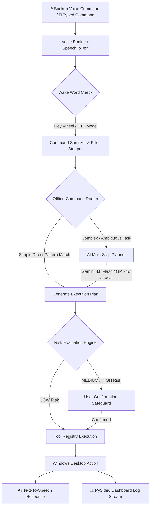

# Vineel Assistant - Windows Desktop AI Voice Agent 🤖🎙️

**Vineel Assistant** is an autonomous, lightweight, local-first Windows desktop computer agent designed to convert natural spoken or typed commands into real system actions on your Windows PC.

Unlike simple text chatbots, Vineel Assistant acts as a local **Jarvis-style agent**: it discovers installed applications, controls keyboard & mouse automation, manages open windows, captures screenshots, navigates web browsers, and safely executes multi-step workflows.

---

## 🏗️ Architecture & Execution Pipeline

The assistant operates on a hybrid **Offline-First + AI Planning** pipeline:



### How It Works: Step-by-Step

1. **Voice / Text Capture**: Continuous mic listening (`SpeechRecognition`) with ambient noise adjustment or PTT toggle button.
2. **Wake Word Engine**: Listens for wake words (e.g., `"Hey Vineel"`) and extracts the actionable command.
3. **Conversational Preprocessing**: Strips filler words (e.g., *"can you please..."*, *"could you..."*) and trailing punctuation.
4. **Offline Command Router**: Matches standard single or compound actions (e.g. *"Open Chrome and search YouTube"*) locally in `<1ms` without requiring external API calls.
5. **AI Multi-Step Planner**: Uses **Gemini 3.8 Flash** (or OpenAI / Mock fallback) to decompose complex natural language requests into structured tool call sequences.
6. **Tool Registry & Safety Guard**: Evaluates risk level (**LOW**, **MEDIUM**, **HIGH**). Prevents destructive actions without user confirmation.
7. **Desktop Automation & Feedback**: Performs real PyAutoGUI / Windows API calls, logs results in real time, and speaks feedback aloud via TTS (`pyttsx3`).

---

## 🌟 Key Features

- **Desktop Action Execution**: Opens Chrome, Firefox, Edge, VS Code, Notepad, Calculator, Command Prompt, PowerShell, and File Explorer.
- **Application Discovery**: Scans Windows Registry `App Paths`, PATH, and Start Menu shortcuts (`.lnk`) to locate exact executables safely.
- **Browser Automation**: Navigates URLs, opens new tabs, closes tabs, reloads, and performs Google/YouTube searches.
- **Keyboard & Mouse Simulation**: Types strings, presses single keys (`Enter`, `Esc`, `Tab`), and executes hotkeys (`Ctrl+C`, `Ctrl+V`, `Alt+Tab`).
- **Window Control**: Lists open windows, focuses active windows, minimizes, maximizes, and closes windows.
- **Modern PySide6 Dashboard**: Dark-mode UI with glowing status indicators, activity log stream, and system tray minimization.

---

## 🛠️ Tool System & Risk Levels

| Tool Name | Description | Risk Level |
| :--- | :--- | :---: |
| `open_application` | Launch desktop application by name or alias | **LOW** |
| `close_application` | Terminate running process | **MEDIUM** |
| `type_text` | Simulate keyboard typing into active window | **LOW** |
| `press_key` | Press single keyboard key (`enter`, `escape`, etc.) | **LOW** |
| `hotkey` | Execute key combinations (`ctrl+l`, `alt+tab`) | **LOW** |
| `open_url` | Open URL or website in web browser | **LOW** |
| `search_web` | Perform Google or YouTube search | **LOW** |
| `list_windows` | List titles of all visible desktop windows | **LOW** |
| `focus_window` | Focus/activate target window | **LOW** |
| `take_screenshot` | Capture full-screen screenshot | **LOW** |
| `execute_shell_command` | Execute raw Windows terminal command | **HIGH** |
| `shutdown_system` | Initiate Windows system shutdown sequence | **HIGH** |

---

## 🚀 Quick Start Guide

### 1. Prerequisites
- **Windows 10 / 11**
- **Python 3.11+**
- Working Microphone (optional for CLI text mode)

### 2. Installation & Setup

Clone the repository and enter project directory:
```powershell
cd vineel_assistant
```

Install verified python dependencies:
```powershell
py -m pip install -r requirements.txt
```

### 3. Environment Configuration (`.env`)
Create `.env` file from template:
```powershell
copy .env.example .env
```

Configure `.env`:
```ini
OPENAI_API_KEY=your_openai_api_key_here
GEMINI_API_KEY=your_gemini_api_key_here

LLM_PROVIDER=gemini
LLM_MODEL=gemini-3.8-flash

STT_PROVIDER=speech_recognition
TTS_PROVIDER=pyttsx3
WAKE_WORD=hey vineel
```

---

## 🏃 Running the Assistant

### Mode A: PySide6 Desktop GUI Dashboard
```powershell
py main.py --gui
```
*Launches graphical dark-mode dashboard with real-time log feed, system tray icon, and text command box.*

### Mode B: Interactive CLI Text Command Mode
```powershell
py main.py --text
```
*Test natural language commands instantly without microphone input.*

### Mode C: Continuous Background Voice Mode
```powershell
py main.py --voice
```
*Continuously listens for wake-word "Hey Vineel" and executes spoken instructions.*

---

## 🧪 Automated Testing

Run the unit test suite:
```powershell
py -m unittest discover -s tests
```

---

## 📦 Packaging into Standalone EXE

Package Vineel Assistant into a single Windows `.exe` using PyInstaller:

```powershell
py -m pip install pyinstaller
pyinstaller --noconfirm --onedir --windowed --name VineelAssistant --add-data ".env.example;." main.py
```
*The compiled executable will be created in `dist/VineelAssistant/VineelAssistant.exe`.*

---

## 🌐 Uploading to GitHub

Follow these steps to upload this codebase to your GitHub repository:

1. Initialize Git repository:
   ```powershell
   git init
   git add .
   git commit -m "Initial commit of Vineel Assistant V1.0.0"
   ```

2. Link your GitHub remote repository:
   ```powershell
   git remote add origin https://github.com/YOUR_USERNAME/YOUR_REPO_NAME.git
   git branch -M main
   git push -u origin main
   ```

---

## 🔮 Future Roadmap (V2)
- **Computer Vision Control**: Plug in VLM (`ScreenAnalyzer`) for visual element detection.
- **Local Faster-Whisper**: 100% offline speech recognition option.
- **Playwright Browser Deep Automation**: Direct web form manipulation and browser interaction.
